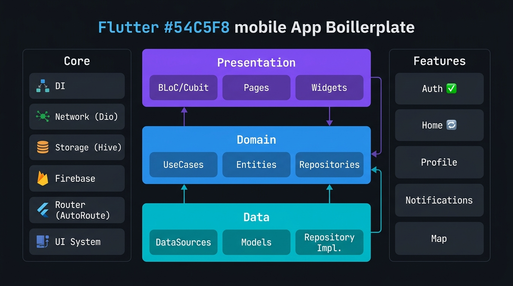

<div align="center">

# 🚀 Flutter App Boilerplate

**Enterprise-grade Flutter starter kit built with Clean Architecture & Feature-First design**

[](https://flutter.dev)
[](https://dart.dev)
[](LICENSE)
[](https://blog.cleancoder.com/uncle-bob/2012/08/13/the-clean-architecture.html)
[](https://bloclibrary.dev)

</div>

---


---

## 📖 Overview

A production-ready Flutter boilerplate designed for **medium to large-scale** applications. Every feature is fully modular and independently testable, following Clean Architecture principles across three distinct layers: **Data**, **Domain**, and **Presentation**.

### ✨ Key Highlights

- 🏗️ **Clean Architecture** — strict separation of concerns across all features
- 🧩 **Feature-First** — each feature is fully self-contained and plug-and-play
- 💉 **Dependency Injection** — GetIt + Injectable with auto-registration
- 🌐 **Network Layer** — Dio + Retrofit with interceptor chain (auth, logging, retry, error)
- 🔥 **Firebase Suite** — Auth, FCM, Analytics, Crashlytics, Remote Config
- 🗄️ **Multi-Storage** — Hive, SecureStorage, SharedPreferences
- 🗺️ **Type-safe Routing** — AutoRoute with route guards
- 🎨 **UI System** — Theming, ScreenUtil, reusable widget kit
- 🌍 **Localization** — English + Persian (RTL) with EasyLocalization
- 🧪 **Testing** — Unit, BLoC, and repository tests with Mocktail

---

## 🏛️ Architecture

```
┌─────────────────────────────────────────┐
│           Presentation Layer            │
│         BLoC / Cubit · Pages · Widgets  │
├─────────────────────────────────────────┤
│             Domain Layer                │
│      Entities · UseCases · Repos        │
├─────────────────────────────────────────┤
│              Data Layer                 │
│    DataSources · Models · Repo Impl     │
└─────────────────────────────────────────┘
```

Each feature follows this exact structure independently, with no cross-feature dependencies.

---

## 📁 Project Structure

```
lib/
├── main.dart
├── app/                        # Root widget, theme, router
├── core/
│   ├── di/                     # GetIt + Injectable setup
│   ├── network/                # Dio, Retrofit, WebSocket, Interceptors
│   ├── error/                  # Exceptions, Failures, Error Handler
│   ├── storage/                # Hive, SecureStorage, SharedPreferences
│   ├── firebase/               # FCM, Analytics, Crashlytics, RemoteConfig
│   ├── permissions/            # Permission handler
│   ├── device/                 # Camera, GPS, DeviceInfo
│   ├── localization/           # EasyLocalization + generated keys
│   ├── router/                 # AutoRoute + Guards
│   ├── usecases/               # Abstract UseCase base
│   ├── utils/                  # Extensions, Validators, Constants
│   └── ui/                     # Theme, Colors, Typography, Widget Kit
└── features/
    ├── auth/                   # ✅ Complete
    ├── home/                   # 🔄 In Progress
    ├── profile/
    ├── notifications/
    └── map/
```

---

## 🔧 Tech Stack

| Category | Package |
|---|---|
| **State Management** | `flutter_bloc` · `freezed` |
| **DI** | `get_it` · `injectable` |
| **Network** | `dio` · `retrofit` · `web_socket_channel` |
| **Storage** | `hive_flutter` · `flutter_secure_storage` · `shared_preferences` |
| **Firebase** | `firebase_core` · `firebase_auth` · `firebase_messaging` · `firebase_analytics` · `firebase_crashlytics` · `firebase_remote_config` |
| **Routing** | `auto_route` |
| **Localization** | `easy_localization` |
| **UI** | `flutter_screenutil` · `lottie` · `shimmer` · `cached_network_image` · `flutter_animate` |
| **Device** | `camera` · `image_picker` · `geolocator` · `google_maps_flutter` · `permission_handler` |
| **Utils** | `dartz` · `equatable` · `connectivity_plus` |
| **Testing** | `bloc_test` · `mocktail` |

---

## 🚀 Getting Started

### Prerequisites

- Flutter SDK `>=3.0.0`
- Dart SDK `>=3.0.0`
- Firebase project (for Firebase features)

### Installation

```bash
# Clone the repository
git clone https://github.com/your-username/app_boilerplate.git
cd app_boilerplate

# Install dependencies
flutter pub get

# Run code generation
flutter pub run build_runner build --delete-conflicting-outputs

# Run the app
flutter run
```

### Firebase Setup

```bash
# Install FlutterFire CLI
dart pub global activate flutterfire_cli

# Configure Firebase for your project
flutterfire configure
```

### Code Generation

```bash
# One-time build
flutter pub run build_runner build --delete-conflicting-outputs

# Watch mode (during development)
flutter pub run build_runner watch --delete-conflicting-outputs
```

---

## 🌍 Localization

The app supports **English** and **Persian (Farsi)** with full RTL support.

```json
// assets/translations/en.json
{
  "common": { "ok": "OK", "cancel": "Cancel", "loading": "Loading..." },
  "auth": { "login": "Login", "register": "Register", "logout": "Logout" }
}
```

Adding a new language: create `assets/translations/<locale>.json` and add the locale to `EasyLocalization` in `main.dart`.

---

## 🧪 Testing

```bash
# Run all tests
flutter test

# Run with coverage
flutter test --coverage
```

Test coverage includes:

- **Core:** Dio client, storage services, interceptors
- **Feature (Auth):** repository, usecases, BLoC
- **Helpers:** shared mocks and test data

---

## 📦 Build Flavors

| Flavor | Entry Point |
|---|---|
| Development | `lib/main_dev.dart` |
| Staging | `lib/main_staging.dart` |
| Production | `lib/main.dart` |

```bash
flutter run --target lib/main_dev.dart
flutter run --target lib/main_staging.dart
```

---

## 📊 Development Progress

| Phase | Description | Status |
|---|---|---|
| 1 | Project Bootstrap | ✅ Complete |
| 2 | Core Network Layer | ✅ Complete |
| 3 | Storage Layer | ✅ Complete |
| 4 | Firebase Suite | ✅ Complete |
| 5 | Device Integration | ✅ Complete |
| 6 | UI System | ✅ Complete |
| 7a | Theming (Light / Dark) | ✅ Complete |
| 7b | Home Feature Foundation | 🔄 In Progress |
| 8 | Auth Feature (end-to-end) | ✅ Complete |
| 9 | Testing | ⏳ Planned |
| 10 | Final Polish & Production | ⏳ Planned |

---

## 🤝 Contributing

Contributions are welcome! Please open an issue or submit a pull request.

1. Fork the repository
2. Create your feature branch (`git checkout -b feature/amazing-feature`)
3. Commit your changes (`git commit -m 'feat: add amazing feature'`)
4. Push to the branch (`git push origin feature/amazing-feature`)
5. Open a Pull Request

---

## 📄 License

This project is licensed under the MIT License — see the [LICENSE](LICENSE) file for details.

---

<div align="center">

Made with ❤️ using Flutter

</div>
